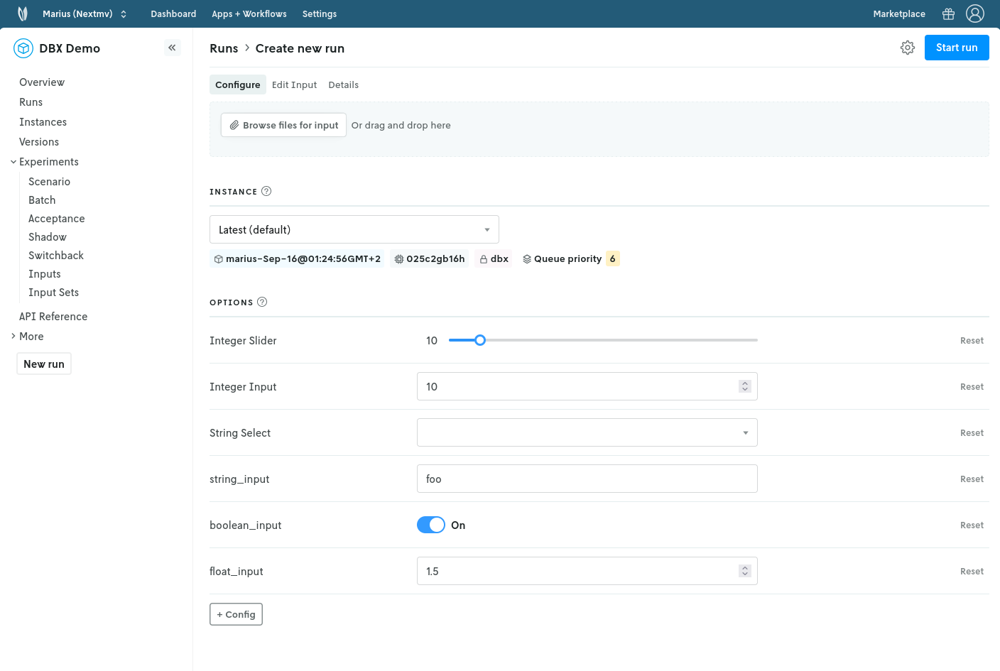
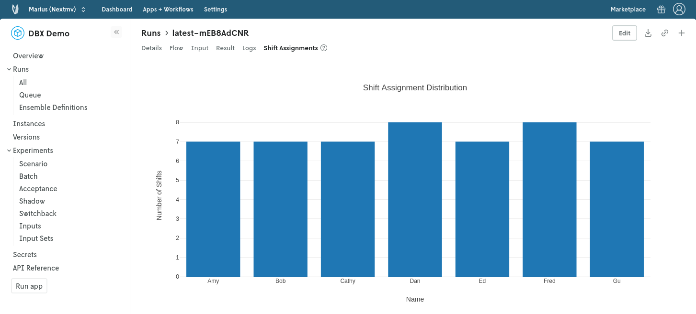

# Databricks Nextmv integration demo

This is a demo showcasing how to integrate a Databricks job with a Nextmv
workflow as the orchestrator and visual enhancer.

This demo uses the [Gurobi workforce scheduling example][gurobi-example] as a
starting point for the job running on Databricks. The tasks of the job can be
arbitrarily modified/extended to fit your use case.

## Setup

These steps need to be done only once.

1. Add this repo to your Databricks workspace.
    - Navigate to the workspace in the Databricks UI, click on the top right
    "Create" button and select "Git folder".
    - Paste the URL of this repo and click "Create".
    - URL: `https://github.com/nextmv-support/databricks`
    - Alternatively, you can fork this repo first so that you can modify it.
      When forking into a private repo, Databricks will need access to it. You
      can install the Databricks app into your GitHub account to do so.
    - Of course, you can also add files manually or in any other way.
2. Create a new Job in Databricks.
    - Add a new task of type "Notebook" and select the notebook
      `job/workforce_scheduling.ipynb` from the Git folder you just added.
    - Check the sample notebook for how to emit results and receive parameters.
      The only modification was made at the end of the Gurobi workforce
      scheduling example to showcase emitting metrics/results and echoing
      parameters.
    - Note the job ID (you will need it later).
3. Create a workflow app in the [Nextmv Console][console].
    - Navigate to the "Apps + Workflows" section, click the `+` and select
      "New workflow".
    - Name the app (e.g., `dbx-workforce-scheduling`) and create it.
4. Create a [secret collection][secret] in the [Nextmv Console][console] for the
   workflow app with the name `dbx` and add the following entries:
    - `DATABRICKS_HOST`: The host URL of your Databricks instance (e.g., `https://cust-success.cloud.databricks.com`).
    - `DATABRICKS_TOKEN`: A personal access token for your Databricks instance
    - `DATABRICKS_JOB_ID`: The job ID of the job you created in step 2.
    - `NEXTMV_API_KEY`: Your Nextmv API key (you can find it in settings in the
      [Nextmv Console][console]).
5. Push the workflow code to the app.
    - Clone this repo locally if you haven't already.
    - Navigate to the `workflow` folder in the terminal.
    - Male sure you have the [Nextmv CLI][install-cli] installed and configured.
    - Run `nextmv app push -a <app-name>` (replace `<app-name>` with the name
      you chose in step 3).
6. Configure the default instance of the app to use the `dbx` secret collection.
    - Navigate to the "Instances" tab of the app, click on the default instance,
      edit it and select the `dbx` secret collection you just created.

## Using the integration

After everything is set up, here are some typical things to do when working with
the integration.

1. Make a run via [Nextmv Console][console].
    - Navigate to your workflow app and click the `+` button next to "Runs".
    - Note: at the moment _some_ input is required though it is not used by this
      example. You can just pass `{"foo": "bar"}` as input.
    - You can also leverage experiments, run comparisons and other features of
      the Nextmv platform.
2. Make changes to the workflow code.
    - Modify the code in the `workflow` folder as needed.
    - Push the changes with `nextmv app push -a <app-id>`.
    - You can also cut versions of the app and create new instances if needed
      (e.g., simply via the console or by appending
      `nextmv app push ... --create-version <version-id>` or similar when
      pushing).
    - Or, create more workflow apps as needed.
3. Make changes to the job code.
    - Modify the notebook in the `job` folder as needed or add more files.
    - Push the changes via git (or update manually when not using Git).

## Preview of a run on Nextmv Console

Starting the run:

Finished run with custom visuals:

## Next steps

- Visit our [docs][docs] and [blog][blog]. Need more assistance?
  [Contact][contact] us!

[docs]: https://docs.nextmv.io
[console]: https://cloud.nextmv.io
[secret]: https://www.nextmv.io/docs/using-nextmv/reference/secret-collections
[install-cli]: https://docs.nextmv.io/docs/using-nextmv/setup/install#nextmv-cli
[blog]: https://www.nextmv.io/blog
[contact]: https://www.nextmv.io/contact
[gurobi-example]: https://www.gurobi.com/jupyter_models/workforce-scheduling
