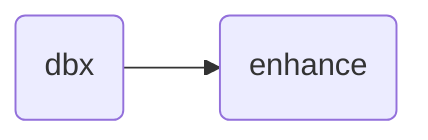

# Databricks Nextmv integration workflow

This is a simple workflow demonstrating how to integrate a Databricks job with
a Nextmv workflow. The first step in the workflow runs a Databricks job, and the
second step relays and enhances the result.

The simple workflow is visualized below:

